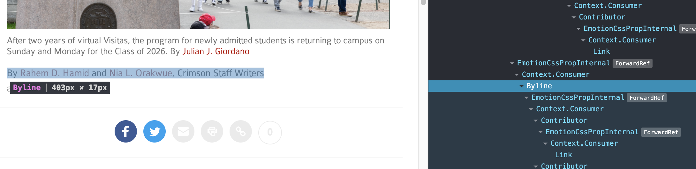
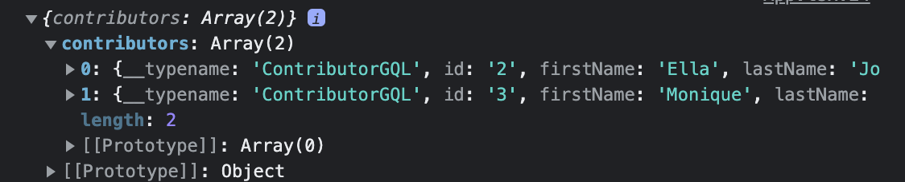

# React lab (part 2)
We're going to go a bit more into components by designing a `Byline` component. 



Get the React DevTools extension in Chrome to see the above ^. 

# Back to Basics

This portion is completely ripped off the [React documentation](https://reactjs.org/docs/hello-world.html). 

## JSX

JSX is Javascript that allows use of HTML tags (called elements) as values. For example, we can set the variable `element` equal to the `h1` tag as follows:
```jsx
const element = <h1>Hello, world!</h1>;
```
We can insert variables into JSX in a manner resembling JS template strings. As an example, 
```jsx
const name = 'Josh Perez';
const element = <h1>Hello, {name}</h1>;
```
We can set attributes using actual strings or using variables: 
```jsx
const element = <a href="https://www.reactjs.org"> link </a>;
const element2 = <a href={user.url}></a>;
```
Do not use both quotes and curly braces. 

## Rendering
React can display the elements we create to the user. This is known as rendering. All rendering is taken care of through a root node. You can see this is done in `crimsonbouquet/frontend/src/index.tsx`:
```jsx
render(
  <ApolloProvider client={client}>
    <BrowserRouter>
      <App />
    </BrowserRouter>
  </ApolloProvider>,
  document.getElementById('root'),
);
```

However, notice that `index.html` doesn't actual exist here, so how is this working? [Read this to find out!](https://stackoverflow.com/questions/42438171/wheres-the-connection-between-index-html-and-index-js-in-a-create-react-app-app)

**Elements are immutable. Once it is rendered, it cannot be changed.** Instead, a new element must be created and rendered to overwrite it. These types of things that update live are essentially unused in the Crimson codebase, but you are welcome to read more about them.

## Components and Props

A component is a "smart" element. Lets say we want to display the name of a contributor, and also link to the contributors page. For a single contributor, we would do something like this:
```jsx
<Link to={"/some/url/here/"}>Some Name</Link>
```
But lets say we wanted to do this for a lot of contributors all at once. Well, we could use a `for` loop. However, lets say we also to be able to do so in various places, and not just in a single block. This leads us to user-defined components. These allow us to do this all in one block: 
```tsx
<Contributor url="a website" name="Joe Mamma" />
```

A *functional component* must take in the argument `props` and return a React element, so that it can be rendered. The `props` input contains all the attributes set for the component. This is important! Let's look at how `Contributor` is defined in the codebase:

```tsx
function Contributor(props: ContributorGQL) {
  // using the names that are not empty/null
  return <Link to={props.url}>{props.name}</Link>;
}
```

Here, these properties are then able to be accessed by the function as it is written, and this does exactly what we wanted it to do beforehand! Specifically, when we call 
```tsx
<Contributor url="a website" name="Joe Mamma" />
```
`{url: "a website", name: "Joe Mamma"}` is passed in as `props` to the function `Contributor`. Therefore the function returns the following:
```tsx
<Link to={"a website"}>Joe Mamma</Link>
```
This is what gets rendered, and is exactly the same as what we wanted before. 

**Furthermore, components can call other components.** We will see this soon, as we design the byline component.

Finally, some rules about react: `props` is immutable, meaning that the functional component should not attempt to change it. 

You can read about more advanced features, like states, [here](https://reactjs.org/docs/state-and-lifecycle.html). They are not heavily featured throughout the Crimson codebase. 

# Getting Started
In the old data we had, there were actually no articles with more than one writer. So I've now taken the data from 4/22. 

We are working inside the `reactlabtoo` folder, so all path names are relative to that directory.

As before, install the necessary dependencies (using Terminal):
```
python3 -m pip install -r requirements.txt
```
Run the following:
```
python manage.py migrate
python manage.py loaddata new_sample_data
```
Move into the `crimsonbouquet/frontend` directory. Run the following:
```zsh
npm install --force
```
We should now be good to go. To start up the server, as last time, open two terminal tabs. In the first, run, in the base directory (`reactlabtoo`)
```
python manage.py runserver
```
In the second, move into the `crimsonbouquet/frontend` and run
```
npm start
```
Now go to `localhost:3000` and you should be able to see the website from last week. 

# Designing the Byline Component
What is a byline again? I'm not sure why its called that, but this is what it looks like:


**!!This is displayed beneath the title of each article!!**

This actually uses more data than we have made available. So lets redefine what we want our Byline to display.

Your byline should display the following:
- the names of the contributors
- links to each of the contributors webpages
- the contributor titles - this is a little different from the actual website, which uses an attribute denoted the `bylineType`. We don't have that in our highly simplified database, and thus instead, we'll display the writer's title. 

The desired output format is then as follows:
```
[Writer1 Name], [Writer1 Title];
[Writer2 Name], [Writer2 Title];
...
```
where each writer name is linked to the appropriate webpage. 

**!!Each writers page is located at `/id/firstname_lastname/`.** 

## Getting Started
So how do we pass data to a potential `Byline` component?

From last week, we know that all of the action is happening in `crimsonbouquet/frontend/src`. This file had gotten pretty cluttered, so we've moved the irrelevant functions away. 

Recall that we want to place the byline beneath the title of each article - hence we should probably make changes within the `ArticlePage` component. Lets take a look at the query `GET_ARTICLE` we are sending:
```js
const GET_ARTICLE = gql`
  query GetArticle($slug: String!) {
    content(slug: $slug) {
      title
      text
      contributors {
        firstName
        lastName
        title
      }
    }
  }
`
```
Notice that we are already asking for the contributors, their first names, and their last names. This is all the information we need to build our Bylines, so there is no need to do anything more with GraphQL.

Lets start by creating a Byline component:
```jsx
const Byline = function() {
  return <div>byline placeholder</div>;
}
```
Place this right before the `ArticlePage` component, since this will be used within it. Lets now place this appropriately within `ArticlePage`, so that it appears in the correct place when we view any of the articles.
```jsx
const ArticlePage = function() {
  ...
  ...
  ...
  return (
    <div className="article">
      <h1> {data.content.title} </h1>
      <Byline />
      <div className="body" dangerouslySetInnerHTML={{__html: data.content.text}} />
    </div>
  );
}
```
You should now see this:


Sidenote: It is very unfortunate that I decided to start this using a Typescript template, because its just adding a lot of pain that doesn't help with understanding.

## Adding names
So now that the byline is positioned property, lets work on actually having it display data. Recall from above that this is done using props. What should we pass the Byline component? The names and titles of the people.

We need to pass this through `props`. Note that the information is located within the `ArticlePage` component, inside the `data` variable, as this stores the return value of the GraphQL query. Checking the query itself, its clear that it is located in `data.content.contributors`. Lets pass this as props and see what it looks like. Change the Byline component as follows, so we can print out the props:
```jsx
const Byline = function(props: any) {
  console.log(props);
  return <div>byline placeholder</div>;
}
```

Change the `ArticlePage` component like this, so we can pass in the props:
```jsx
const ArticlePage = function() {
  ...
  ...
  return (
    <div className="article">
      <h1> {data.content.title} </h1>
      <Byline contributors={data.content.contributors}/>
      <div className="body" dangerouslySetInnerHTML={{__html: data.content.text}} />
    </div>
  )
}
```

Take a look at an article - what do you see logged in the console?


As you can see, we've appropriately passed in the contributors. 

Note that this is actually an array of contributors, since we have two writers here. 

Lets now display their names. Change `Byline` as follows:
```tsx
const Byline = function(props: any) {
  console.log(props);

  let names = props.contributors.map((contrib: any) => <div key={contrib.id}>{contrib.firstName} {contrib.lastName}</div>)
  return (
    <div>
      {names}
    </div>
  );
}
```
What we are doing here is mapping over the list of contributors, and for each, we're creating a `div` element containing their first and last names. 

Your webpage should now look like this:

Of course, there is only one writer here, so it looks a bit simpler. 

## Building a Contributor Component
Recall that we actually want to end up linking each writer to their webpage, and that we also want to display their title. This is a bit more complicated, so lets break this out into its own component. Lets say we are given a single contributor. How should we structure the `Contributor` component, given what we want?
```tsx
const Contributor = function(props: any) {
  let contrib = props.contrib
  return (
    <div>
      <Link to={`contrib/${contrib.id}/${contrib.firstName}_${contrib.lastName}`}>{contrib.firstName} {contrib.lastName}, {contrib.title};</Link>
    </div>
  );
}
```
Make sure you try to understand whats being done here. The format of the link was given to you above. We are then including the persons first name, last name, and then title. 

Now lets test this out. Note that we shouldn't see any changes yet - the Contributor component isn't being used yet.

## Putting it together

While before, in `Byline`, we were creating `div`s with each contributors name, lets now use the `Contributor` component:
```tsx
const Byline = function(props: any) {
  console.log(props);

  let names = props.contributors.map((contrib: any) => <Contributor contrib={contrib} />)
  return (
    <div>
      {names}
    </div>
  );
}
```
Note how we pass the contributor that we are iterating over to the `Contributor` component, which then returns an appropriate JSX element. Your page should now look something like this:


And thats it!